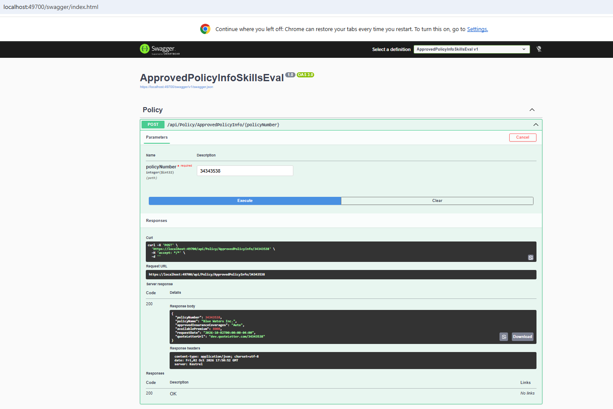

# Web API Testing Results

This document records the verified manual Swagger test for the Healthcare Policy Web API.

## Test Environment

- Framework: .NET 8 ASP.NET Core Web API
- API documentation/test client: Swagger UI
- Local HTTPS URL: `https://localhost:49700`
- Endpoint: `POST /api/Policy/ApprovedPolicyInfo/{policyNumber}`

## Verified Success Test

**Policy number:** `34343538`

**Request:**

```http
POST https://localhost:49700/api/Policy/ApprovedPolicyInfo/34343538
```

**Verified HTTP status:** `200 OK`

**Verified response body:**

```json
{
  "policyNumber": 34343538,
  "policyName": "Blue Waters Inc.",
  "approvedInsuranceCoverages": "Auto",
  "availablePremium": 8000,
  "requestDate": "2026-10-02T00:00:00-04:00",
  "quoteLetterUrl": "dev.quoteLetter.com/34343538"
}
```

The response confirms that the controller accepted the policy number, the service located the matching policy in the mock data store, coverage logic was applied, and the API returned the result successfully.

## Swagger Output



## Additional Test Cases to Run

These are recommended validation tests. They are not marked as verified until executed and captured.

| Test | Input | Expected behavior |
|---|---:|---|
| Existing policy | `34343538` | `200 OK` with Blue Waters Inc. policy data |
| Existing policy | `58343582` | `200 OK` with Silver Rock LLC policy data |
| Unknown policy | `99999999` | `400 Bad Request` with `Policy not found.` |
| Invalid policy number | `0` | `400 Bad Request` with `Invalid policy number.` |
| Negative policy number | `-1` | `400 Bad Request` with `Invalid policy number.` |

## Automated Unit Tests

The solution also contains xUnit tests in `ApprovedPolicyInfoSkillsEval.Test` for premium validation. Run them from Visual Studio using **Test > Test Explorer > Run All**.
